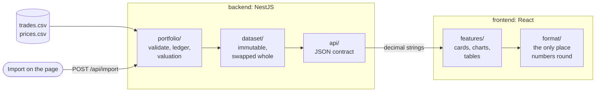

# Coinance

A crypto portfolio dashboard: it imports a trade history, values it with a price snapshot, and shows holdings, weighted-average cost, realized and unrealized P&L, fees, and the transactions behind every figure.

**Live:** https://assessment-z7u0.onrender.com/ (the first load can take up to a minute).

Plans and decisions: [`docs/plans/`](docs/plans/README.md).
How the AI agent was used: [AI_WORKFLOW.md](AI_WORKFLOW.md).

## Run it

Put the supplied `trades.csv` and `prices.csv` in `data/`.
Without them, import a trades file from the page (examples in [`samples/`](samples/README.md)).
**Reset to sample data** reloads `data/`.

**Docker**, on http://localhost:3000:

```bash
docker build -t coinance .
docker run -p 3000:3000 -v "$PWD/data:/app/data:ro" coinance
```

**From source**, with Node 24:

```bash
corepack enable
pnpm bootstrap
pnpm dev          # http://localhost:5173
```

| Command | What it does |
| --- | --- |
| `pnpm dev` | API and web app, reloading on change |
| `pnpm test` | All tests |
| `pnpm verify` | Lint, typecheck, tests and build |
| `pnpm build` then `pnpm start` | Production build on :3000 |
| `python3 -m unittest discover -s scripts` | Tests of the Python reference script |

Tests assert known numbers, worked out by hand or by an independent Python script.

| Variable | Default | Purpose |
| --- | --- | --- |
| `PORT` | `3000` | HTTP port |
| `DATA_DIR` | `../data` | Folder with `trades.csv` and `prices.csv` |
| `STATIC_DIR` | `../frontend/dist` | Built web app served at `/` |
| `LOG_LEVEL` | `info` | Log level |

## Architecture



- `portfolio/` holds all the calculation, in plain TypeScript with no framework.
- A new dataset is built in full before it replaces the old one, so a rejected import changes nothing.
- The web app never computes P&L; it only formats what the API sends.

## Calculation

Weighted-average cost, per asset across both exchanges, trades in `timestamp` order (`trade_id` breaks ties).

| Event | Rule |
| --- | --- |
| BUY | cost basis += quantity × price + fee; quantity += bought; average = cost basis ÷ quantity |
| SELL | realized P&L += quantity × price − fee − average × quantity sold; the average stays as it was |
| Full close | quantity, cost basis and average become exactly 0 before the next BUY |
| Valuation | value = quantity × price; unrealized = value − cost basis; total = realized + unrealized; allocation = value ÷ portfolio value |

Fees are already inside P&L; Total fees is shown for information only.

An import is all or nothing: any invalid row rejects the file and every problem is listed with its line ([rules](docs/plans/01-calculation-core.md#import-rules-as-they-stand)).

The sample data gives value **$60,620.89**, cost basis $59,969.24, realized −$5,052.96, unrealized +$651.65, total **−$4,401.31** and fees $2,708.86, matching the independent Python reference ([`scripts/reference.py`](scripts/reference.py)).

## Precision

- Amounts use `decimal.js` (60 significant digits), never JS numbers, which leave dust after full closes.
- Imported amounts have at most 8 decimal places and 12 integer digits, so only divisions round.
- The API sends full-precision decimal strings; the browser rounds once, half-even, for display.

[Details and examples](docs/plans/01-calculation-core.md#precision-and-rounding-as-it-stands).

## Assumptions

1. Positions are per asset across both exchanges; the exchange filter applies to the transaction list.
2. Importing replaces the whole trade history.
3. One shared dataset for every visitor; a restart returns to the sample.
4. Prices are a fixed snapshot, not importable.
5. Unrealized P&L is also shown as a percentage of the cost basis.
6. A held asset without a price is flagged and left out of value and allocation.

[Reasons](docs/plans/00-analysis.md#assumptions).

## Limitations and tradeoffs

- Data lives in memory: imports are lost on restart.
- One long-running server rather than serverless, because of the in-memory dataset.
- The whole portfolio is recomputed on each import; fine for thousands of trades, not millions.
- The frontend keeps its own copy of the API types, checked against the backend's by the typecheck.
- The charts library makes up most of the 200 KB (gzipped) bundle.

## Future improvements

- A database, with one portfolio per user.
- A per-exchange view, with transfers between exchanges.
- Price history and a portfolio value chart.
- Other cost methods (FIFO, specific identification).
- Export, and browser end-to-end tests.
