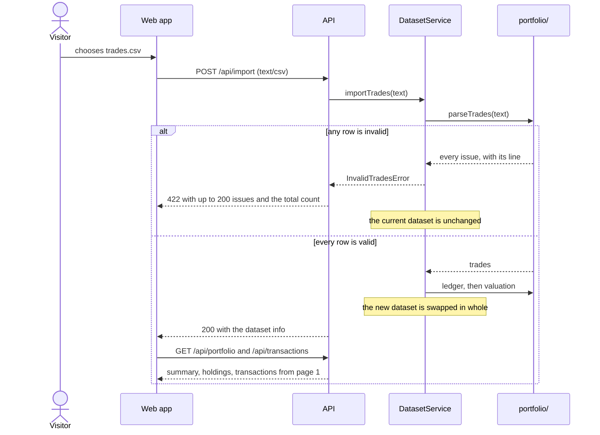

# 2. API

Goal: put the calculation core behind a small HTTP API, without letting the framework leak into the domain.

## Scope

- `dataset/`: the active dataset in memory, read-only once built.
  `buildDataset` analyses parsed trades against the price snapshot; the service loads the sample files on boot, swaps in an import only when it is fully valid, and resets to the sample.
- `api/`: controllers for portfolio, transactions, import, reset and health.
  `contract.ts` defines the JSON shapes; `serialize.ts` turns decimals into strings.
- `api/transactions/`: query validation (zod, strict), then filter, sort and page on the server.
- `infra/`: pino logger, one request log line per call, an error filter that maps every failure to `{ code, message, issues? }`.
- `app.ts`: `configureApp` (helmet, `/api` prefix, `text/csv` body up to 2 MB, the error filter, the built frontend when present), shared by `main.ts` and the tests.
- `config.ts`: `DATA_DIR` and `STATIC_DIR` from the environment, with the repository folders as defaults.

Out of scope: auth, persistence across restarts, prices import (see the [assumptions](00-analysis.md#assumptions)).

## Decisions

- **Exchange scope.**
  A file valid per asset can still sell more on one exchange than was bought there, so a per-exchange portfolio could fail on valid data.
  The portfolio stays per asset; the exchange filter belongs to the transaction explorer, which is what the task asks for.
- **Import body.**
  Raw `text/csv` instead of multipart: one file, no upload library, the size limit enforced by the body parser.
- **Decimal strings.**
  `toFixed()` rather than `toString()`, which gave `1e-8` for small amounts.
  Rounded half-even to 20 places, because division leaves noise near the 36th place that no one needs to see (revised after review, below).
- **Warnings name files, not paths.**
  An early version put the server's absolute data path into a warning shown to clients.
- **One origin.**
  The API serves the built frontend when `index.html` exists, so production has one URL and no CORS.

## Import flow

## Acceptance

- [x] `GET /portfolio` for the sample: 200 trades, total P&L `-4401.3084972465` to 10 places, no warnings.
- [x] Transactions: every filter, both sort orders, pagination bounds, unknown parameters rejected with 400.
- [x] Import is all-or-nothing: a bad file answers 422 with up to 200 issues and the total count, and leaves `/portfolio` unchanged; a good one replaces the dataset; reset brings the sample back.
- [x] Errors: unknown route 404, oversized body 413, wrong content type 415, all in the error shape.
- [x] Serializer: plain notation at full precision (first 20 places, half-even; revised after review).
- [x] Static: `/` serves `index.html`, `/api/*` never falls through to it.
- [x] `pnpm verify` exits 0; the compiled server answers the checks above with `curl`.

## Revised after review

- The API cut decimals at 20 places, so a value just above half a cent could round twice; it now sends full precision (see *Decimal strings* above).
- `DatasetService` threw HTTP errors (422, 409); it now throws its own (`dataset/errors.ts`) and the controller maps them.
- The dataset is read-only by type, down to holdings and trade effects; responses copy its arrays instead of sharing them.
  It keeps prices with their warnings as one snapshot instead of finding price warnings by their text.
- `backend/test/api/contract-mirror.ts` fails the typecheck when `frontend/src/api/types.ts` stops matching the contract.
- Fields no client read (`priceAsOf` and `tradeCount` per holding, `feesPaid`, the stored ledger) were removed.
